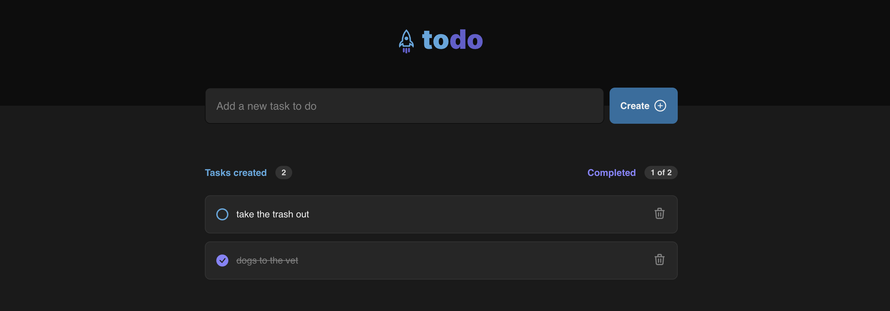

# ToDoList - Vite


<h1 align="center">
    
</h1>

A simple to do list application built using Vite. This project is part of the ReactJS Ignite Trail.

## :rocket: Technologies

This project was made using the following technologies:

- [TypeScript](https://www.typescriptlang.org/)
- [Vite](https://vitejs.dev/)
- [LocalStorage](https://developer.mozilla.org/en-US/docs/Web/API/Window/localStorage/)

## :computer: How to run

```bash
# Clone repository
$ git clone https://github.com/debfdias/ToDoListVite/

# Access folder
$ cd ToDoListVite
```

```bash
# Install dependencies
$ yarn

# Run aplication
$ yarn dev

```

